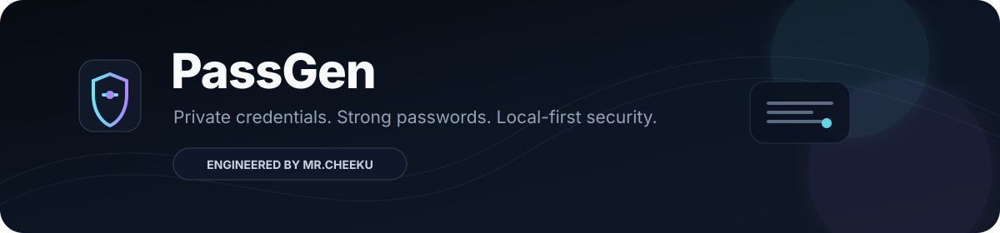
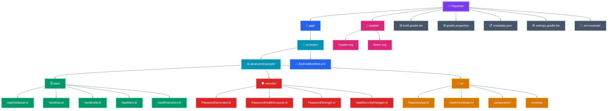

<div align="center">



<p>
  <a href="https://github.com/MrCheeku/PassGen"></a>
  <a href="https://github.com/MrCheeku/PassGen"></a>
  <a href="https://github.com/MrCheeku/PassGen"></a>
</p>

<p><strong>Strong password generation • Local vault storage • Encrypted backups</strong></p>

<a href="https://github.com/MrCheeku"></a>

</div>

---

## 🔐 What is PassGen?

**PassGen** is a modern Android password generator and personal credential vault designed around a **local-first** workflow. The project combines secure password generation, credential organization, a master lock, and encrypted backup import/export in one focused app.

### ✨ Highlights

| Capability | What it does |
|---|---|
| **Password Generator** | Generates passwords from uppercase, lowercase, numbers, and symbols with configurable length from 6–64 characters. |
| **Password Vault** | Stores credential records including title, username, password, website, notes, favorites, and timestamps. |
| **Master Lock** | Supports an app-level PIN lock with salted PBKDF2-HMAC-SHA256 verification. |
| **At-Rest Encryption** | Uses AES-256-GCM for sensitive vault fields and Android Keystore-backed key material when available. |
| **Encrypted Backups** | Exports and imports the vault through an encrypted JSON envelope protected by a user-supplied password. |
| **Theme Support** | Includes persisted system, dark, and light theme preferences. |

> **Security note:** the current implementation includes a fallback local key path for environments where Android Keystore is unavailable. Review that behavior carefully before treating the project as a production security product.

---

## ✨ Core Experience

```text
Generate → Review Strength → Save Credential → Lock Vault → Export Encrypted Backup
```

PassGen's UI is built from focused Jetpack Compose screens and reusable components, including dashboard, generator, master-lock, settings, credential cards, password-strength UI, and add/edit flows.

---

## 🧰 Tech Stack

<div align="center">

### Android & UI


### Architecture & Storage


### Security


</div>

---

## 🧭 Project Structure

> 🎨 **Interactive Mermaid architecture:** every major layer has its own color, arrows show how the folders connect, and the compact top-to-bottom layout is designed for smaller screens.



### 📱 Mobile-friendly note

This is **real Mermaid source — not a picture**. The compact `TB` layout keeps the hierarchy narrow, but GitHub controls Mermaid rendering in each client. If the GitHub Android app displays the Mermaid source instead of the rendered diagram, that is a limitation of that app/version and cannot be forced by README code.

<details>
<summary>📂 View Project Structure as Text</summary>

```text
🔐 PassGen
│
├── 📱 app/
│   └── 🧩 src/main/
│       ├── ☕ java/com/example/
│       │   ├── 🗄️ data/
│       │   │   ├── AppDatabase.kt
│       │   │   ├── VaultDao.kt
│       │   │   ├── VaultEntity.kt
│       │   │   ├── VaultItem.kt
│       │   │   └── VaultRepository.kt
│       │   ├── 🛡️ security/
│       │   │   ├── PasswordGenerator.kt
│       │   │   ├── PasswordHealthAnalyzer.kt
│       │   │   ├── PasswordStrength.kt
│       │   │   └── VaultSecurityManager.kt
│       │   └── 🎨 ui/
│       │       ├── PassGenApp.kt
│       │       ├── VaultViewModel.kt
│       │       ├── components/
│       │       └── screens/
│       └── 📄 AndroidManifest.xml
│
├── 🎨 assets/
│   ├── header.svg
│   └── footer.svg
│
├── ⚙️ build.gradle.kts
├── ⚙️ gradle.properties
├── 📋 metadata.json
├── ⚙️ settings.gradle.kts
└── 🔑 .env.example
```

</details>

### 🔄 How the pieces connect

```text
📱 App Entry
    │
    ├── 🎨 UI Layer ────────► Screens + Components
    │             │
    │             └──────────► VaultViewModel
    │                            │
    ├── 🗄️ Data Layer ──────────┴──► Room Database + Repository
    │
    └── 🛡️ Security Layer ─────────► Password Generation + Encryption + Lock
```

The structure is intentionally grouped by responsibility so a new contributor can quickly see where **UI**, **storage**, and **security** logic live.

---

## 🛡️ Security Design

PassGen currently implements several concrete security mechanisms:

- **SecureRandom** is used for password generation and security salts/IVs.
- Vault passwords and sensitive notes are encrypted at rest with **AES/GCM/NoPadding**, using a 256-bit Android Keystore key when available.
- Master-lock PINs are stored as salted **PBKDF2WithHmacSHA256** derived hashes rather than as plaintext PINs.
- Backup files use a separate password-derived key and AES-GCM encrypted payload.

This README describes the implementation currently present in the repository; it is not a claim of independent security auditing.

---

## 🚀 Getting Started

### Requirements

- Android Studio with a recent Android/Gradle toolchain
- JDK 11+
- Android SDK matching the project's configured compile/target SDK

### Clone with HTTPS

```bash
git clone https://github.com/MrCheeku/PassGen.git
cd PassGen
gradle assembleDebug
```

### Clone with SSH

SSH is useful when you regularly clone, pull, or push from your development machine. GitHub uses your SSH key pair for authentication; **keep the private key private** and only add the public key to your GitHub account.

```bash
git clone git@github.com:MrCheeku/PassGen.git
cd PassGen
gradle assembleDebug
```

> The repository currently uses Gradle project configuration but does not include a checked-in `gradlew` wrapper script. Opening the project in Android Studio is the easiest setup path.

The Android module is configured for `compileSdk` 36 and `targetSdk` 36, with Java source/target compatibility set to Java 11.

---

## 🧪 Testing

The Android module includes JVM tests, Android instrumentation tests, Compose UI test dependencies, Robolectric, and Roborazzi testing support.

```bash
gradle test
```

---

## 📦 Backup Format

Encrypted backups are represented as a small JSON envelope:

```json
{
  "app": "PassGen",
  "format": "encrypted_vault_v1",
  "salt": "…",
  "iv": "…",
  "ciphertext": "…"
}
```

The encrypted payload is generated from vault data and a user-supplied export password.

---

## 🌐 Official Links

<div align="center">

<a href="https://techwithcheeku.lovable.app/"></a>

<a href="https://whatsapp.com/channel/0029Vb9OpwgD8SDvISwrn73Y"></a>

<a href="https://discord.gg/GWJvzcxuN"></a>

</div>

---

## 👨‍💻 Engineered By

<div align="center">

<a href="https://github.com/MrCheeku"></a>

### **Mr.Cheeku**

<a href="https://github.com/MrCheeku"></a>

</div>

---

<div align="center">

<a href="https://github.com/MrCheeku/PassGen/issues">Report an issue</a>
&nbsp;•&nbsp;
<a href="https://github.com/MrCheeku/PassGen">View source</a>
&nbsp;•&nbsp;
<a href="https://github.com/MrCheeku">Developer profile</a>

<br /><br />


</div>

<!-- LIVE_STARS: 0 | automatically synced 2026-09-06T17:36:45.220Z -->
